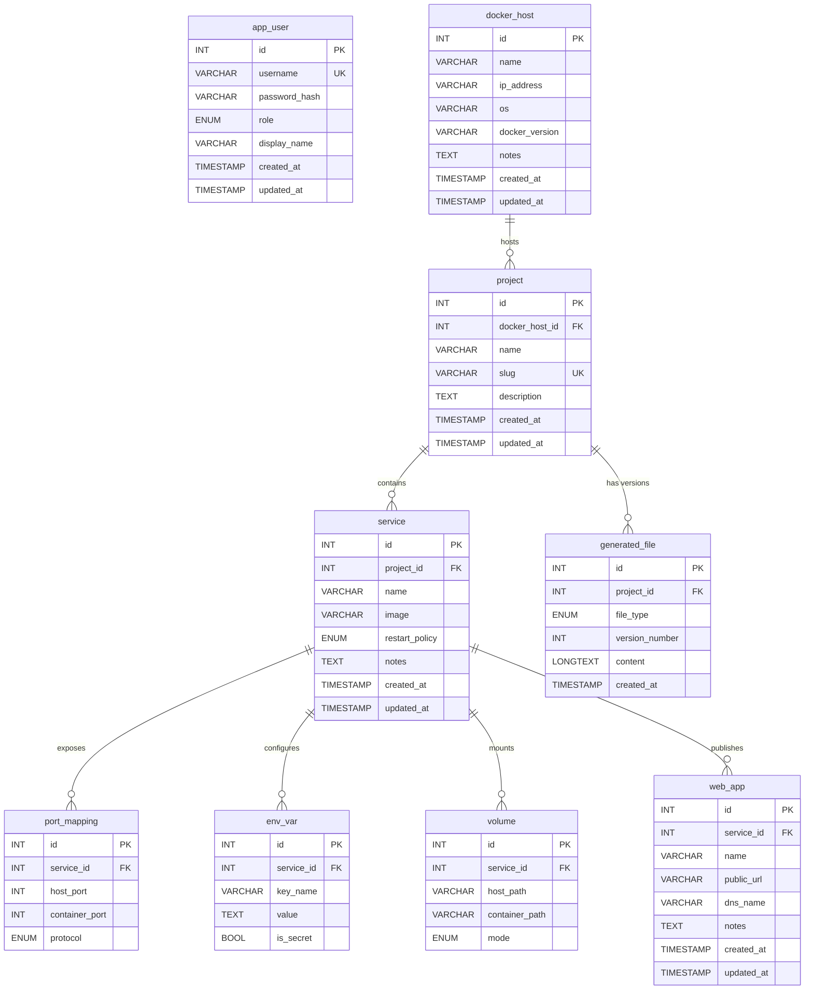

# Manifesto

## Курсов проект по „Уеб програмиране"

**Софийски университет „Св. Климент Охридски"**
**Факултет по математика и информатика**
**Летен семестър 2025/2026**

---

### Заглавна страница

| Поле | Стойност |
|---|---|
| **Заглавие на проекта** | Manifesto — Declare your infrastructure. Generate your stack. |
| **Курс** | Уеб програмиране (Web Programming) |
| **Семестър** | Летен 2025/2026 |
| **Преподавател** | (попълнете името на лектора) |
| **Студент(и)** | (Име, Фамилия — ФН) |
| **Подпис(и)** | _______________________ |
| **Дата на предаване** | (попълнете датата) |

---

## Съдържание

1. [Резюме](#1-резюме)
2. [Постановка на задачата](#2-постановка-на-задачата)
3. [Технологии и архитектура](#3-технологии-и-архитектура)
4. [База данни](#4-база-данни)
5. [Функционалности](#5-функционалности)
6. [Сигурност](#6-сигурност)
7. [Инструкции за подкарване](#7-инструкции-за-подкарване)
8. [Ръководство за ползване](#8-ръководство-за-ползване)
9. [Заключение](#9-заключение)

---

## 1. Резюме

**Manifesto** е уеб приложение (dashboard) на vanilla PHP 8 и MySQL/MariaDB, без използване на framework, което позволява структурирано описание на Docker-базирана инфраструктура и генерира конфигурационни файлове от въведените данни.

Потребителят описва инфраструктурата си в йерархична форма — Docker хост → Compose проект → Service (с портове, environment variables, volumes) → публично достъпно Web App. След това с един клик генератора произвежда:

- `docker-compose.yml` (валиден YAML за Docker Compose v3.8)
- `.env` файл (групиран по service, маркирани secret стойности)
- Emmet textual export (UTF-8 дърво с box-drawing символи)

Всяка генерация се версионира и съхранява в база данни. Потребителят може да преглежда история, да сваля файлове или да регенерира при промяна.

Приложението реализира role-based access control (administrator / viewer), CSRF защита, SQL injection защита и сесийно управление с regenerate след login. Може да се пуска под XAMPP или като Docker stack (`docker compose up`).

---

## 2. Постановка на задачата

### 2.1 Цел

Да се изгради уеб приложение, което позволява:

1. **Декларативно описание** на Docker инфраструктура чрез CRUD интерфейс
2. **Автоматично генериране** на конфигурационни файлове от описанието
3. **Версионирана история** на всяка генерация
4. **Безопасно използване** — приложението НЕ оркестрира контейнери, а само описва и генерира

### 2.2 Целеви потребители

- **Администратор** — пълен достъп: създава/редактира/изтрива записи, генерира файлове
- **Преглеждащ (viewer)** — read-only достъп: вижда всичко, но няма право да променя

### 2.3 Функционални изисквания (FR)

| ID | Изискване | Приоритет |
|----|-----------|-----------|
| FR-01 | Login с username/password, сесийно управление | MUST |
| FR-02 | CRUD на Docker хостове | MUST |
| FR-03 | CRUD на Compose проекти | MUST |
| FR-04 | CRUD на Services (с inline port mappings, env vars, volumes) | MUST |
| FR-05 | CRUD на Web Apps | MUST |
| FR-06 | Генериране на `docker-compose.yml` от проект | MUST |
| FR-07 | Генериране на `.env` файл от проект | MUST |
| FR-08 | Emmet текстов export на йерархията | MUST |
| FR-09 | Версионирана история на генерираните файлове | MUST |
| FR-10 | Download на конкретна версия от history | MUST |
| FR-11 | Маскиране на secret env values при export | MUST |
| FR-12 | Role-based access control (admin / viewer) | MUST |
| FR-13 | Server-side проверка на ролите (не само UI hide) | MUST |
| FR-14 | Sidebar tree с цялата инфраструктура (експандираеми възли) | SHOULD |
| FR-15 | Уникални slug-ове за проекти | MUST |

### 2.4 Нефункционални изисквания (NFR)

- **Setup на нова машина** под 10 минути
- **Без framework** (изискване на курса)
- **Без vendor зависимости** (composer.json само за PSR-4 autoload)
- **PDO prepared statements** за всички SQL заявки
- **Bcrypt** за съхранение на пароли
- **CSRF token** на всички state-changing форми
- **UTF-8 (utf8mb4)** end-to-end
- **Работи в произволна поддиректория** (например `/w26/manifesto-fnXXX/`)
- **Работи offline** (без CDN, без външни fonts)

---

## 3. Технологии и архитектура

### 3.1 Технологичен стек

| Слой | Технология |
|---|---|
| Backend | PHP 8.1+ (vanilla, PSR-4 autoload) |
| Database | MySQL 8.0+ / MariaDB 10.4+ |
| Frontend | HTML5 + CSS3 + vanilla JavaScript |
| Web server | Apache 2.4 с mod_rewrite |
| Контейнер | Docker (опционално) — `php:8.2-apache` + `mariadb:10.11` |

### 3.2 Архитектурни принципи

- **Layered architecture** — ясно разделение между HTTP, бизнес логика и data access
- **Repository Pattern** — всички SQL заявки изолирани в repository класове
- **POPO/DTO Models** — Models нямат логика, само properties
- **Stateless Services** — генераторите са pure functions (data → string)
- **Single source of configuration** — всички настройки идват от `.env`

### 3.3 Слоева структура

```
┌─────────────────────────────────────────────────────────┐
│ Browser                                                  │
└──────────────────────┬──────────────────────────────────┘
                       │ HTTP
                       ▼
┌─────────────────────────────────────────────────────────┐
│ public/index.php — Front Controller                      │
│  • EnvLoader → config → Database::configure()            │
│  • Session::start() + CSRF verify                        │
│  • Router::dispatch()                                    │
└──────────────────────┬──────────────────────────────────┘
                       │
                       ▼
┌─────────────────────────────────────────────────────────┐
│ Controllers (src/Controllers/)                           │
│  • Validate input                                        │
│  • Call Repositories / Services                          │
│  • Return Response::view() or Response::redirect()       │
└─────────┬─────────────────────────────────────┬─────────┘
          │                                     │
          ▼                                     ▼
┌──────────────────────┐         ┌──────────────────────┐
│ Repositories         │         │ Services             │
│ (src/Repositories/)  │         │ (src/Services/)      │
│ All PDO queries      │         │ Generators           │
└──────────┬───────────┘         └──────────────────────┘
           │
           ▼
┌─────────────────────────────────────────────────────────┐
│ MySQL / MariaDB                                          │
└─────────────────────────────────────────────────────────┘
```

### 3.4 Структура на проекта

```
Manifesto/
├── public/                  ← DocumentRoot (front controller + assets)
│   ├── index.php
│   ├── .htaccess
│   └── assets/
│       ├── css/app.css
│       └── js/app.js
├── src/
│   ├── Core/                ← Router, Auth, Database, Session, CSRF, Request,
│   │                          Response, ViewRenderer, EnvLoader, helpers
│   ├── Models/              ← 9 POPO DTO класа
│   ├── Repositories/        ← 8 PDO repository класа
│   ├── Services/            ← 3 stateless генератора
│   ├── Controllers/         ← 7 HTTP controllers
│   └── Views/               ← PHP templates (layouts, partials, errors, CRUD форми)
├── config/
│   ├── config.php           ← single config entry — чете .env
│   └── routes.php           ← route table
├── db/
│   ├── schema.sql           ← 9 таблици с FK constraints
│   └── seed.sql             ← demo данни
├── storage/
│   ├── logs/                ← error log
│   └── generated/           ← cache
├── docs/                    ← документация
├── Dockerfile
├── docker-compose.yml
├── .env.example
├── composer.json
├── README.md
└── README.txt
```

### 3.5 Request flow (диаграма)

```
1. Browser  GET /projects/5
2. Apache   .htaccess rewrites → /public/index.php?
3. PHP      EnvLoader reads .env
4. PHP      Database::configure() (PDO singleton)
5. PHP      Session::start()
6. PHP      Csrf::verify() if POST
7. Router   matches GET /projects/{id} → ProjectController::show
8. Ctrl     ProjectRepository::findWithHost(5)
9. Repo     PDO prepared statement → DB
10. Ctrl    Response::view('projects/show', [...])
11. View    Renders layout + partials + content
12. Browser receives HTML
```

### 3.6 Архитектурни инварианти

| Инвариант | Значение |
|---|---|
| Controllers НЕ правят PDO заявки | Изолация на data access слоя |
| Views НЕ правят PDO заявки | Templates само рендват |
| Models нямат бизнес логика | POPO DTO — само properties |
| Services са stateless | Чисти функции data → string |
| CSRF навсякъде | Защита на state-changing endpoints |
| Output винаги escape-нат | XSS защита |

---

## 4. База данни

### 4.1 ER диаграма



### 4.2 Описание на таблиците

| Таблица | Цел | Ключови constraints |
|---|---|---|
| `app_user` | Login на dashboard потребители | UNIQUE(username), ENUM(admin, viewer) |
| `docker_host` | Описание на Docker сървър | Самостоятелен entity |
| `project` | Един Docker Compose проект | UNIQUE(slug), FK→docker_host |
| `service` | Един контейнер в проект | UNIQUE(project_id, name), FK→project ON DELETE CASCADE |
| `port_mapping` | Port mappings на service | FK→service ON DELETE CASCADE |
| `env_var` | Environment variables | FK→service ON DELETE CASCADE; is_secret флаг |
| `volume` | Volume mounts | FK→service ON DELETE CASCADE; ENUM(rw, ro) |
| `web_app` | Публично достъпен endpoint | FK→service ON DELETE CASCADE |
| `generated_file` | Версионирана история на генерациите | FK→project ON DELETE CASCADE |

### 4.3 Стандарти

- Engine: **InnoDB** (transactional, FK support)
- Charset: **utf8mb4_unicode_ci** (full Unicode + emoji support)
- Всички FK имат `ON DELETE CASCADE` (с изключение на project→docker_host = RESTRICT)
- Индекси за всички FK колони и за често търсените полета (slug, username)

---

## 5. Функционалности

### 5.1 Authentication

- Login форма на `/login` с username + password
- `password_verify()` срещу bcrypt hash в БД
- След успешен login: `session_regenerate_id(true)` (anti-fixation)
- Logout инвалидира сесията
- Guest само може да види `/login`; всички други URL-и → redirect

### 5.2 CRUD за всички entities

- Списък (`index`)
- Създаване (`create` GET форма + `store` POST)
- Преглед (`show`)
- Редактиране (`edit` GET форма + `update` POST)
- Изтриване (`destroy` POST с CSRF token)

### 5.3 Inline child management при Service

Service формата позволява добавяне/премахване на множество редове за:
- Port mappings (host_port:container_port/protocol)
- Environment variables (key=value, secret флаг)
- Volumes (host_path:container_path:mode)

Динамичните редове се добавят с vanilla JavaScript (без библиотеки).

### 5.4 Generators

Три stateless генератора в `src/Services/`:

#### DockerComposeGenerator

Генерира валиден Docker Compose v3.8 YAML:

```yaml
version: "3.8"

services:
  web:
    image: nginx:alpine
    restart: unless-stopped
    ports:
      - "8080:80/tcp"
    volumes:
      - "./html:/usr/share/nginx/html:ro"
  db:
    image: mariadb:10.11
    restart: always
    environment:
      MYSQL_ROOT_PASSWORD: "change-me-secret"
      MYSQL_DATABASE: "blog"
    volumes:
      - "./db-data:/var/lib/mysql:rw"
```

Прави YAML-safe quoting за стойности със спец символи. Празни секции се пропускат.

#### EnvFileGenerator

Генерира `.env` файл, групиран по service:

```env
# Generated by Manifesto · Demo Blog · 2026-06-10T12:34:56+00:00

# === Service: web ===
# (no env vars)

# === Service: db ===
# SECRET — store in vault, do not commit
MYSQL_ROOT_PASSWORD=change-me-secret
MYSQL_DATABASE=blog
```

#### EmmetExporter

Генерира UTF-8 дърво с box-drawing символи:

```
local-dev [ip=127.0.0.1, docker=28.0]
└─ demo-blog
   ├─ web [image=nginx:alpine, restart=unless-stopped]
   │  ├─ port: 8080:80/tcp
   │  ├─ env: (none)
   │  ├─ volume: ./html:/usr/share/nginx/html (ro)
   │  └─ webapp: Blog Frontend
   └─ db [image=mariadb:10.11, restart=always]
      ├─ env: MYSQL_ROOT_PASSWORD=•••••• (secret), MYSQL_DATABASE=blog
      └─ volume: ./db-data:/var/lib/mysql (rw)
```

### 5.5 Версионирана история

Всяка генерация увеличава `version_number` за проекта и записва трите файла (compose, env, emmet) с този номер. Потребителят може да:

- Преглежда последните версии (`/projects/{id}/files`)
- Сваля конкретна версия (`/files/{id}/download`)
- Регенерира (новата става `version_number + 1`)

---

## 6. Сигурност

### 6.1 Заплахи и защити

| Заплаха | Защита | Имплементация |
|---|---|---|
| SQL injection | PDO prepared statements | Всички repositories ползват `$stmt->execute([...])` |
| XSS | HTML escape | `htmlspecialchars()` чрез `e()` helper във views |
| CSRF | Hidden token | Generated в `Csrf::token()`, проверен централно в `index.php` |
| Session hijacking | Regenerate ID | `session_regenerate_id(true)` след login |
| Session fixation | HttpOnly cookies | `session.cookie_httponly=1` в config |
| Password storage | Bcrypt | `password_hash($pwd, PASSWORD_BCRYPT)` |
| Privilege escalation | Server-side guard | `Router::enforceAccess()` за всеки маршрут |

### 6.2 CSRF flow

```
1. ViewRenderer добавя <input name="_csrf_token" value="..." hidden>
2. Token-ът е генериран от Csrf::token() и пазен в сесия
3. На всеки POST request: index.php извиква Csrf::verify()
4. Невалиден token → Response::abort(419) → errors/419.php
```

### 6.3 Authorization flow

```
1. Routes имат meta поле 'access': 'guest' | 'auth' | 'admin'
2. Router::dispatch() извиква enforceAccess() преди controller
3. 'guest'  : не трябва да си logged-in
4. 'auth'   : всеки logged-in user
5. 'admin'  : само Auth::role() === 'admin'
6. Неоторизиран → 403 Forbidden
```

### 6.4 Допълнителни мерки

- `is_secret` флаг на env vars — UI маскира стойността като `••••••`
- В `.env` export — secret лайновете имат коментар `# SECRET — store in vault`
- Default credentials в `seed.sql` са документирани като demo-only
- `.env` файлът е в `.gitignore` (не се commit-ва)

---

## 7. Инструкции за подкарване

### 7.1 Изисквания

- PHP 8.1 или по-нова, с extensions: `pdo`, `pdo_mysql`, `mbstring`, `json`
- MySQL 8.0+ или MariaDB 10.4+
- Apache 2.4 с `mod_rewrite` (или nginx с rewrite rules)
- (опционално) Composer — само за PSR-4 autoload optimization
- (опционално) Docker + Docker Compose v2

### 7.2 Setup в XAMPP

```bash
# 1. Копирай проекта в htdocs
cp -R Manifesto/ /Applications/XAMPP/htdocs/manifesto/    # macOS
# или
xcopy Manifesto C:\xampp\htdocs\manifesto /E /I            # Windows

# 2. Старт XAMPP Control Panel: Apache + MySQL

# 3. Създай база и импортирай данни
/Applications/XAMPP/bin/mysql -u root < db/schema.sql
/Applications/XAMPP/bin/mysql -u root manifesto < db/seed.sql

# 4. Конфигурация
cp .env.example .env
# Default стойностите работят с XAMPP — не пипай нищо

# 5. (опционално) Composer autoload
composer dump-autoload
# Без Composer също работи — има PSR-4 fallback

# 6. Отвори в браузъра
open http://localhost/manifesto/
```

### 7.3 Setup с Docker

```bash
cp .env.example .env
docker compose up -d
# Изчакай ~30 секунди за инициализация на DB

open http://localhost:8080/

# Login: admin / admin123
```

### 7.4 Setup в поддиректория

Копирай папката в поддиректория на htdocs:

```bash
cp -R Manifesto/ /Applications/XAMPP/htdocs/w26/manifesto-fnXXXXX/
```

Отвори `http://localhost/w26/manifesto-fnXXXXX/`. URL-ите автоматично включват префикса (заслуга на `Request::basePath()`).

### 7.5 Конфигурационни параметри (`.env`)

```env
# Database (XAMPP defaults)
DB_HOST=127.0.0.1
DB_PORT=3306
DB_NAME=manifesto
DB_USER=root
DB_PASS=

# App
APP_DEBUG=1                     # 0 в production

# Docker-only (игнорират се при XAMPP)
APP_HTTP_PORT=8080
DB_ROOT_PASSWORD=manifesto_root
DB_EXPOSED_PORT=33060
```

### 7.6 Default credentials (от seed.sql)

| Username | Password | Role |
|---|---|---|
| `admin` | `admin123` | Administrator |
| `viewer` | `viewer123` | Read-only viewer |

> ⚠️ Demo credentials. Производствени системи трябва да сменят паролите.

---

## 8. Ръководство за ползване

Подробно ръководство със всички flows и екранни снимки — виж [`USER_GUIDE.md`](USER_GUIDE.md).

Кратко резюме на главните flows:

### 8.1 Login

`/login` → въвеждане на admin/admin123 → dashboard.

### 8.2 Управление на инфраструктура

1. Създай Docker host (`/docker-hosts/create`)
2. Създай Project под този host (`/projects/create`)
3. Добави Services (`/projects/{id}/services/create`) с inline ports/envs/volumes
4. Добави Web Apps на service (`/services/{id}/webapps/create`)

### 8.3 Генериране

От страница на проект → бутон **„Generate files"** → системата произвежда трите файла → redirect към `/projects/{id}/files` за preview и download.

### 8.4 Разлика admin vs viewer

- **Admin** — пълни CRUD права, бутоните Edit/Delete/Generate видими
- **Viewer** — read-only, Edit/Delete/Generate бутоните скрити; директен POST към protected endpoint връща 403

---

## 9. Заключение

Проектът Manifesto демонстрира пълна реализация на CRUD уеб приложение на vanilla PHP без framework, с интегрирано генериране на инфраструктурни конфигурационни файлове. Архитектурата е чиста и расшируема — добавянето на нов entity или нов тип генериран файл изисква минимални промени.

Проектът покрива всички задължителни изисквания (FR-01 до FR-15) и спазва нефункционалните изисквания за сигурност, портативност и offline работа.

### 9.1 Възможности за разширение

- Bidirectional Emmet parser (вход → дърво)
- Импорт от съществуващ `docker-compose.yml`
- Автоматични health checks с cron
- Public REST API
- Multi-tenancy (организации, проекти на различни потребители)

### 9.2 Препоръки за production deployment

- Сменете default credentials на admin/viewer
- Поставете `APP_DEBUG=0` в `.env`
- Активирайте HTTPS (HSTS header)
- Конфигурирайте login throttling срещу brute-force атаки
- Регулярно backup-вайте базата (`mysqldump manifesto`)

---

**Край на документацията.**
