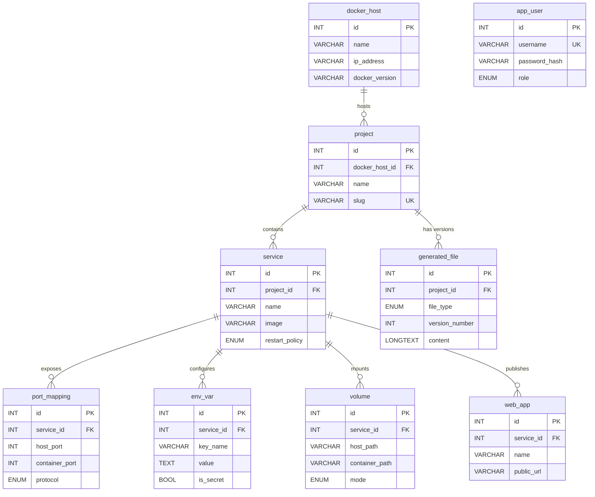

# Ръководство за ползване — Manifesto

> Този документ е написан за защитата на проекта. Покрива всички основни сценарии в приложението с екранни снимки.

**Препоръка за разпечатване:** двустранно, A4. Всеки раздел започва на нова страница.

---

## 0. ER диаграма на базата данни

Следната диаграма показва йерархията на 9-те таблици и техните връзки:



---

## 1. Login страница

При първо отваряне на `http://localhost/manifesto/` се прави автоматичен redirect към `/login`.


**Демо credentials:**

| Роля | Username | Password |
|------|----------|----------|
| Администратор | `admin` | `admin123` |
| Преглеждащ | `viewer` | `viewer123` |

Грешна комбинация → flash съобщение „Invalid username or password".

---

## 2. Dashboard (главна страница)

След успешен login се показва Dashboard с обобщение на инфраструктурата.


В горната част — карти със статистика (брой Docker hosts, projects, services, web apps, generated files).

В **левия sidebar** е показано цялото дърво на инфраструктурата — Docker Host → Project → Service → WebApp. Всеки елемент е кликаем.

---

## 3. Управление на Docker Hosts

`/docker-hosts` — списък на всички Docker сървъри.


### Създаване на нов хост

Клик върху **+ New Docker Host** (видим само за admin).


Полета:
- **Name** (задължително) — кратко уникално име на хоста
- **IP address** — например `127.0.0.1` или `192.168.1.42`
- **OS** — операционна система (`Ubuntu 24.04`, `Windows Server 2022`, ...)
- **Docker version** — версия на Docker engine (`28.0`, `27.5.1`, ...)
- **Notes** — свободен текст

---

## 4. Управление на Projects

`/projects` — списък на всички Compose проекти.


### Създаване на нов проект


Полета:
- **Docker host** (select) — към кой хост принадлежи
- **Name** (задължително) — име на проекта
- **Slug** — URL-friendly идентификатор (auto-generated от името, може да се редактира)
- **Description** — свободен текст

### Преглед на проект


Показва:
- Детайли на проекта (host, slug, description)
- Списък на services
- Бутон **Generate files** (само за admin)
- Бутон **View files** (ако вече има генерирани версии)

---

## 5. Управление на Services

### Създаване на service

От страницата на проект → **+ Add Service**.


Формата има 4 секции:

**Basics:**
- **Name** — име на service в compose (напр. `web`, `db`)
- **Image** — Docker image (напр. `nginx:alpine`)
- **Restart policy** (select) — `no`, `always`, `on-failure`, `unless-stopped`
- **Notes**

**Port mappings** — клик върху **+ Add port** добавя нов ред. Всеки ред:
- Host port (1-65535)
- Container port (1-65535)
- Protocol (tcp / udp)
- × за премахване

**Environment variables:**
- Key
- Value
- Checkbox „secret" — стойността ще се маскира при export

**Volumes:**
- Host path (напр. `./data`)
- Container path (напр. `/var/lib/mysql`)
- Mode (`rw` или `ro`)

### Преглед на service


Показва всички портове, env vars, volumes и web apps в табличен вид. Secret values се показват като `••••••`.

---

## 6. Управление на Web Apps

Web App = публично достъпен endpoint, който използва дадения service.


Полета:
- **Name**
- **Public URL** — пълен URL (напр. `http://localhost:8080`)
- **DNS name** — например `blog.local`
- **Notes**

---

## 7. Генериране на файлове (heart of the project)

От страницата на даден проект → бутон **Generate files**.


Системата генерира едновременно три файла:

### 7.1 `docker-compose.yml`

Валиден Docker Compose v3.8 YAML с всички services, ports, env vars и volumes.


Може да се изтегли с бутона **Download**.

### 7.2 `.env`

Environment variables, групирани по service. Secret стойности са маркирани с коментар.


### 7.3 Emmet export

UTF-8 дърво на цялата йерархия с box-drawing characters. Идеален за документация.


### History

В долната част на `/projects/{id}/files` се показва history — всяка генерация е със собствен version number.


---

## 8. Разлика admin vs viewer

### Admin
- Вижда всичко
- Може да създава/редактира/изтрива всичко
- Може да пуска генерация на файлове

### Viewer
- Вижда всичко
- НЕ вижда бутоните Edit / Delete / Create / Generate
- POST към protected endpoint директно (DevTools / curl) → **403 Forbidden**


---

## 9. Сигурност (за защитата)

| Защита | Имплементация |
|--------|---------------|
| SQL injection | PDO prepared statements (всички queries в repositories) |
| XSS | `htmlspecialchars()` чрез helper `e()` във всички views |
| CSRF | Hidden token във всяка форма + централна проверка в `public/index.php` за всеки POST. Невалиден token → 419 страница |
| Session hijacking | `session_regenerate_id()` след login, HttpOnly cookies |
| Password storage | `password_hash()` (bcrypt cost 10) при insert, `password_verify()` при login |
| Authorization | Router enforce-ва `guest`/`auth`/`admin` access nivo за всеки маршрут |

---

## 10. Често срещани грешки

### „Could not connect to database"
Провери `.env` — DB_HOST, DB_PORT, DB_USER, DB_PASS. По default MySQL в XAMPP е `127.0.0.1:3306` с user `root` и празна парола.

### Login не работи (грешен hash)
Schema + seed да са импортирани в `manifesto` БД. Преинсталирай:
```bash
mysql -u root < db/schema.sql
mysql -u root manifesto < db/seed.sql
```

### 404 на всички URL-и (освен `/`)
`mod_rewrite` не е enabled в Apache. В `httpd.conf` разкоментирай:
```
LoadModule rewrite_module modules/mod_rewrite.so
```
И провери че `<Directory>` блокът има `AllowOverride All`.

### Кирилицата излиза като `???`
Базата трябва да е `utf8mb4_unicode_ci`. Schema-та я създава с правилен charset, но провери че MySQL connection прави `SET NAMES utf8mb4` (Database класът го прави автоматично).

---

## 11. Screenshots папка

Всички екранни снимки са в `docs/screenshots/`. Името на файла отговаря на номера на раздел в това ръководство.

> **Бележка за студента:** Преди защитата заснеми screenshot-и от собствените си екрани и ги сложи в `docs/screenshots/` със съответните имена. Файловете в момента са placeholder-и.
